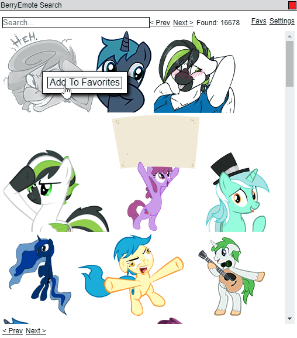
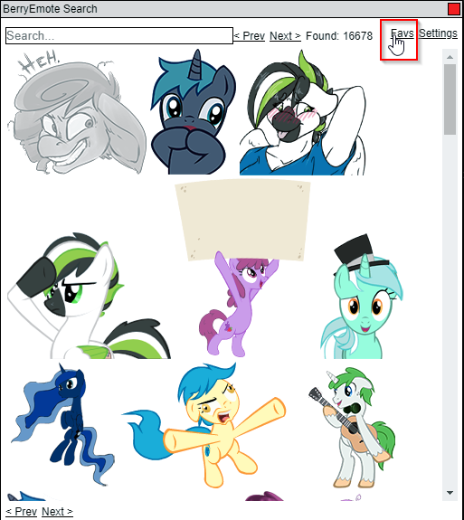
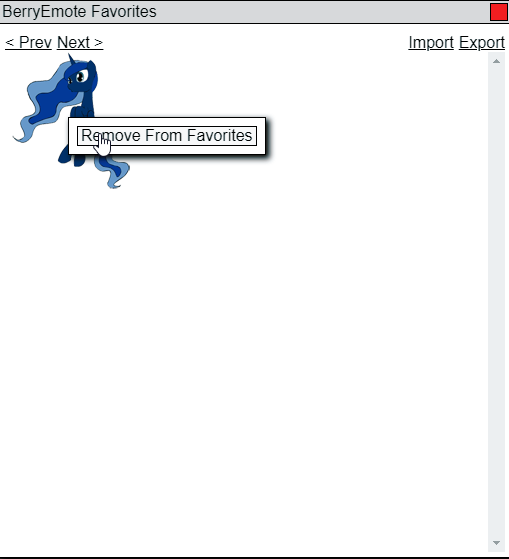

# BerryEmote Favorites Userscript

This userscript adds a favorites section to the popular `Berrymotes` plugin.

## Installation
To install:
1. Make sure you have tampermonkey or greasemonkey installed.
2. Make sure you have the `Berrymotes` plugin enabled.
3. [Click here](https://squirrel623.github.io/BEMFavorites/bem-favorites.user.js) to install the userscript.
4. Reload your current berrytube tab if you have one open.

## Note
Be aware that in the current iteration, storage is tied to your browser's local storage. That means that you will lose your saved favorites if you reset your browser in any way (Clear local storage from settings menu, reinstall browser, ...). See the `Exporting` section below to save your favorites.

## Usage
### Adding a favorite

Right click on an emote in the regular Berrymotes search dialog and click `Add To Favorites`  

### Open favorites dialog

Click on the new `Favs` item in the regular Berrymotes search dialog

### Removing a favorite

Right click on an emote in the favorites dialog and click `Remove From Favorites`

### Using a favorite
This works just like Berrymotes - make sure your chat input had focus before clicking on an emote and it will add the emote to the chat input when you click on an emote.

### Exporting

To export your current favorites, select the `Export` item in the favorites dialog. This will save your favorites to a `bem-favorites.bemf` file in your default download location.

### Importing

To import favorites from a `.bemf` file, select the `Import` item in the favorites dialog. Note that you will lose your current favorites if you do this, so export your current favorites if you do not want to lose them.
